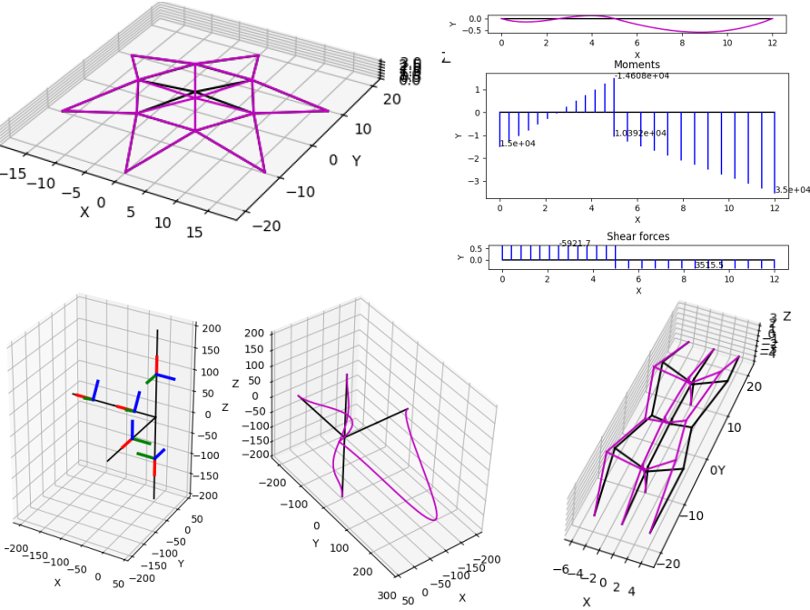

# pystran: Python for Structural Analysis

A simple structural analysis tool in Python.

Linear statics and dynamics can be analyzed in structures consisting of truss and beam members, both in two dimensions and in three dimensions.

The formulations are derived in the Finite element modeling with shells and beams [book](http://hogwarts.ucsd.edu/~pkrysl/femstructures-book/).



## News

- 01/22/2025: Implement initial functionality. 

[Past news](#past-news)

## Limitations

- Two-dimensional and three-dimensional structures made up of truss (axial)
  members and beams (even in combination) can be handled.
- The Bernoulli-Euler model is implemented, so no shear deformation is taken into account.
- Only elastic models can be solved.
- Only straight members are treated.
- Only doubly symmetric cross sections can be handled in three dimensions. Hence
  there is no coupling between the bending actions in the two orthogonal planes.
- Warping of the cross sections is not modelled, hence only free torsion effects are included.
- Member loading is not considered. All member loading needs to be converted to nodal forces.
- Internal hinges can be modelled with linked joints. No member end releases are implemented.
- Degrees of freedom are only along the cartesian axes. Skew supports are not included.
- Offsets are currently not implemented.

## Requirements

- NumPy
- SciPy
- Matplotlib

These requirements can be easily satisfied by running the examples in [Spyder 6](https://www.spyder-ide.org/download/) (IDE).

## Running

This package is not distributed through the official Python channels.
It needs to be downloaded from GitHub as a zip file, and expanded in some convenient location. 

The easiest way to run a pystran example is to download and install [Spyder 6](https://www.spyder-ide.org/download/). It is a complete IDE for Python, including a very capable debugger. Just open an example and click the run button.

It is also possible to run using a plain Python.
The user then needs to install the requirements, and in the
pystran folder rather an example for instance as
```
py examples/linked_cantilevers_prescribed.py
```

## Tutorials

Step-by-step tutorials are available in the [`tutorials`](./tutorials) folder. 
Run tutorials for example as
```
py tutorials/three_bars_tut.py
```

## Examples

There are many examples in the [`examples`](./examples) folder. They may not be heavily documented,
but they do show many recipes for solving truss and beam structures.

## <a name="past-news"></a>Past news
