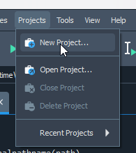
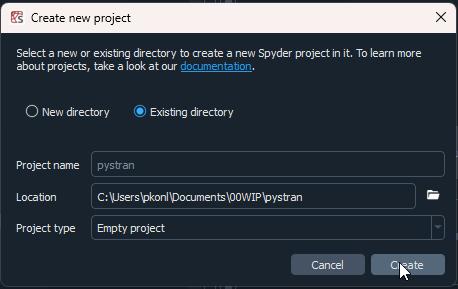
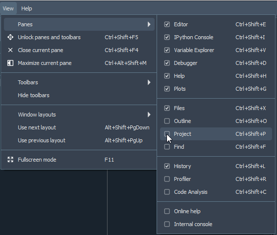
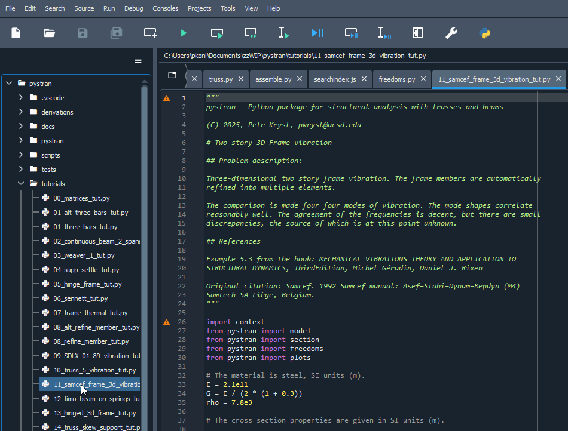

# Using `pystran` with Spyder

The easiest way to run a `pystran` example is to download and install [Spyder 6](https://www.spyder-ide.org/download/). It is a complete IDE for Python, 
including a very capable debugger. Just open an example and click the run button.
[Spyder 6](https://www.spyder-ide.org/download/) (IDE).

The detailed instructions are as follows:

Create new project in Spyder.

Create the project from an "existing" folder, i.e. `pystran` top folder.

Make sure the project pane is showing.

Open a tutorial.

Run the tutorial by clicking the green arrow button.